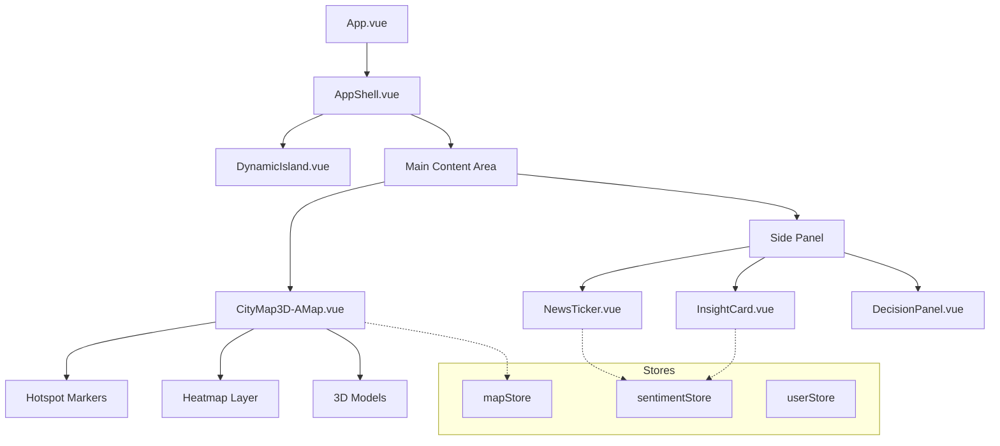

# Design Document - AICity Frontend

## Overview

AICity 前端系统采用 Vue 3 + Vite 技术栈，以 3D 地图可视化为核心，实现舆情监测、分析展示、决策模拟和语音交互等功能。

系统采用组件化架构，按功能模块划分为 Map、Monitor、Analysis、Simulation 四大功能区，配合 Layout 和 UI 基础组件构建完整界面。

## UI/UX Design Standards (UI.md & UX.md)

### Visual Theme: Cyberpunk + Glassmorphism

- **核心主题**: 赛博朋克 + 毛玻璃拟态 + 数据可视化
- **视觉关键词**: 沉浸式、半透明、霓虹光效、全息投影、流动感

### Color System

| 用途       | 颜色                   | Tailwind       |
| ---------- | ---------------------- | -------------- |
| **背景**   | `#0F172A`              | `slate-900`    |
| **主色调** | `#06B6D4` -> `#22D3EE` | `cyan-500/400` |
| **强调色** | `#A855F7`              | `purple-500`   |
| **警报色** | `#EF4444`              | `red-500`      |
| **成功色** | `#10B981`              | `emerald-500`  |
| **文字主** | `#F8FAFC`              | `slate-50`     |
| **文字次** | `#94A3B8`              | `slate-400`    |

### Glass Card Style

```css
/* 毛玻璃卡片基础样式 */
.glass-card {
  @apply bg-slate-900/40 backdrop-blur-xl;
  @apply border border-white/10;
  @apply rounded-2xl;
  @apply shadow-lg shadow-cyan-500/10;
}
```

### Interaction Patterns

- **聚焦模式 (Focus Mode)**: 点击事件时，非相关 UI 降低透明度 (Dimming)，背景模糊
- **数据流光 (Data Flow)**: 组件连接处使用流动光线效果，暗示数据传输
- **脉冲标记 (Pulse Marker)**: 热点事件使用 `animate-ping` 脉冲动画
- **Hover 效果**: 边框亮度增加，背景提亮 `hover:bg-white/5`
- **加载动画**: 卡片依次错落上浮 `staggered fade-in-up`

## Steering Document Alignment

### Technical Standards (tech.md)

- **框架**: Vue 3.5 + Vite 6.0
- **UI**: Element Plus + TailwindCSS
- **状态管理**: Pinia
- **3D 地图**: 高德 JS API 2.0 (唯一方案)
- **3D 渲染**: Three.js (GLCustomLayer)
- **图表**: ECharts
- **实时通信**: Socket.io-client

### Project Structure (structure.md)

```
src/
├── api/                    # API 接口封装
├── components/
│   ├── features/           # 功能组件
│   │   ├── Map/            # 3D 地图
│   │   ├── Monitor/        # 实时监测
│   │   ├── Analysis/       # AI 分析
│   │   ├── Simulation/     # 决策模拟
│   │   ├── Admin/          # 后台管理 (Overlay)
│   │   └── Reports/        # 报表分析 (Overlay)
│   ├── layout/             # 布局组件
│   └── ui/                 # 通用 UI
├── composables/            # 组合式函数
├── stores/                 # Pinia 状态
├── router/                 # 路由配置
└── utils/                  # 工具函数
```

## Code Reuse Analysis

### Existing Components to Leverage

| 组件                   | 位置                 | 复用方式               |
| ---------------------- | -------------------- | ---------------------- |
| **CityMap3D-AMap.vue** | features/Map/        | 扩展，添加更多交互功能 |
| **InsightCard.vue**    | features/Analysis/   | 复用，传入不同分析数据 |
| **NewsTicker.vue**     | features/Monitor/    | 复用，接入实时数据源   |
| **DecisionPanel.vue**  | features/Simulation/ | 扩展，添加 AI 模拟功能 |
| **AppShell.vue**       | layout/              | 作为主布局框架         |
| **GlassPanel.vue**     | ui/                  | 作为面板基础组件       |
| **NeonButton.vue**     | ui/                  | 作为按钮基础组件       |

### Integration Points

- **高德地图 API**: 3D 地图渲染、POI 搜索、区域边界
- **Socket.io**: 实时舆情数据推送
- **讯飞 API**: TTS 语音播报、ASR 语音输入 (通过后端代理)
- **ECharts**: 数据可视化图表

## Architecture

### Modular Design Principles

- **Single File Responsibility**: 每个 .vue 文件只负责一个功能
- **Component Isolation**: 功能组件独立，通过 Props/Events 通信
- **Service Layer Separation**: API 调用封装在 api/ 目录
- **Utility Modularity**: 工具函数按功能拆分



## Components and Interfaces

### CityMap3D-AMap.vue (扩展)

- **Purpose**: 3D 地图主组件，展示舆情热点和区域
- **Interfaces**:
  - Props: `city`, `hotspots`, `selectedId`
  - Events: `@hotspot-click`, `@region-change`, `@map-ready`
- **Dependencies**: @amap/amap-jsapi-loader, Three.js
- **Reuses**: 现有地图初始化逻辑

### NewsTicker.vue (扩展)

- **Purpose**: 实时新闻滚动条
- **Interfaces**:
  - Props: `items`, `autoScroll`, `speed`
  - Events: `@item-click`, `@item-hover`
- **Dependencies**: Element Plus
- **Reuses**: 现有滚动逻辑

### InsightCard.vue (扩展)

- **Purpose**: AI 分析洞察卡片
- **Interfaces**:
  - Props: `sentiment`, `keywords`, `trend`
  - Events: `@analyze-more`
- **Dependencies**: ECharts
- **Reuses**: 现有卡片样式

### DecisionPanel.vue (扩展)

- **Purpose**: 决策模拟面板
- **Interfaces**:
  - Props: `event`, `options`, `results`
  - Events: `@decision-select`, `@simulate`
- **Dependencies**: Element Plus, ECharts
- **Reuses**: 现有面板布局

### VoiceButton.vue (新建)

- **Purpose**: 语音交互按钮组件
- **Interfaces**:
  - Props: `enabled`, `autoPlay`
  - Events: `@speech-result`, `@tts-complete`
- **Dependencies**: 讯飞 WebSocket API (通过后端代理)

### SceneReconstruction.vue (新建)

- **Purpose**: AI 现场还原组件，展示 3D 全息影像
- **Interfaces**:
  - Props: `hotspotId`, `visible`, `position`
  - Events: `@generate-start`, `@generate-complete`, `@generate-error`, `@close`
- **Dependencies**: Three.js, GLTFLoader, OrbitControls
- **Integration**: 使用 sceneStore 管理状态，调用 sceneApi 生成 3D 模型

### AdminLayout.vue (新建)

- **Purpose**: 后台管理系统全屏 Overlay 容器
- **Interfaces**:
  - Events: `@close`
- **Dependencies**: Element Plus, GlassPanel
- **Integration**: 由 AppShell 控制显示，承载所有 Admin 功能子组件

## Data Models

### Hotspot (舆情热点)

```typescript
interface Hotspot {
  id: string;
  position: [number, number]; // [lng, lat]
  title: string;
  level: "high" | "medium" | "low";
  category: string;
  count: number;
  trend: "up" | "down" | "stable";
  time: string;
  source: string;
  content?: string;
  media?: MediaItem[];
}
```

### SentimentAnalysis (情感分析)

```typescript
interface SentimentAnalysis {
  id: string;
  hotspotId: string;
  sentiment: "positive" | "negative" | "neutral";
  score: number; // 0-1
  keywords: string[];
  summary: string;
  prediction: TrendPrediction;
}
```

### DecisionOption (决策选项)

```typescript
interface DecisionOption {
  id: string;
  title: string;
  description: string;
  risk: "low" | "medium" | "high";
  impact: number; // 预测影响分数
  timeline: string;
}
```

### SimulationResult (模拟结果)

```typescript
interface SimulationResult {
  optionId: string;
  scenarios: {
    optimistic: ScenarioData;
    neutral: ScenarioData;
    pessimistic: ScenarioData;
  };
  recommendation: string;
}
```

## State Management (Pinia Stores)

### sentimentStore

```typescript
// stores/sentiment.js
export const useSentimentStore = defineStore('sentiment', {
  state: () => ({
    hotspots: [],
    selectedHotspot: null,
    analysis: null,
    loading: false
  }),
  actions: {
    async fetchHotspots(city),
    selectHotspot(id),
    async analyzeHotspot(id)
  }
})
```

### mapStore

```typescript
// stores/map.js
export const useMapStore = defineStore('map', {
  state: () => ({
    currentCity: 'xinyang',
    zoom: 14,
    center: [114.0913, 32.1477],
    viewMode: '3D'
  }),
  actions: {
    setCity(city),
    setView(zoom, center),
    toggleViewMode()
  }
})
```

### voiceStore

```typescript
// stores/voice.js
export const useVoiceStore = defineStore('voice', {
  state: () => ({
    isListening: false,
    isSpeaking: false,
    transcript: '',
    enabled: true
  }),
  actions: {
    startListening(),
    stopListening(),
    speak(text)
  }
})
```

### sceneStore

```typescript
// stores/scene.js
export const useSceneStore = defineStore('scene', {
  state: () => ({
    generating: false,
    progress: 0,
    models: {},           // 缓存: { [hotspotId]: modelData }
    currentModel: null,
    error: null
  }),
  actions: {
    async generateScene(hotspotId, description),
    loadCachedModel(hotspotId),
    clearCache(),
    setProgress(value)
  }
})
```

## API Layer

### api/index.js

```javascript
// API 统一导出
export * from "./sentiment";
export * from "./map";
export * from "./decision";
export * from "./scene";
```

### api/sentiment.js

```javascript
// 舆情相关 API
export const sentimentApi = {
  getHotspots(city, filters),
  getHotspotDetail(id),
  getAnalysis(hotspotId)
}
```

### api/map.js

```javascript
// 地图相关 API
export const mapApi = {
  getCityData(cityCode),
  getRegionBoundary(adcode, level)
}
```

### api/decision.js

```javascript
// 决策模拟 API
export const decisionApi = {
  getOptions(hotspotId),
  simulate(hotspotId, optionId),
  customSimulate(hotspotId, customInput)
}
```

### api/scene.js

```javascript
// 场景还原 API (Tripo AI 集成)
export const sceneApi = {
  generate3D(hotspotId, description),
  getModelStatus(taskId),
  loadModel(modelUrl)
}
```

## Error Handling

### Error Scenarios

1. **地图加载失败**

   - **Handling**: 显示 2D 备选地图或错误提示
   - **User Impact**: 提示用户检查网络，提供重试按钮

2. **API 请求失败**

   - **Handling**: 使用 Element Plus Message 显示错误
   - **User Impact**: 显示友好错误信息，不阻塞其他功能

3. **WebSocket 断开**

   - **Handling**: 自动重连，最多 5 次
   - **User Impact**: 显示连接状态指示器

4. **语音识别失败**
   - **Handling**: 显示错误提示，允许手动输入
   - **User Impact**: 提示用户使用文字输入替代

## Testing Strategy

### Unit Testing

- 使用 Vitest 测试组件逻辑
- 测试 Pinia Store actions 和 getters
- 测试工具函数

### Integration Testing

- 测试组件间通信
- 测试 API 调用流程
- 测试状态同步

### End-to-End Testing

- 使用 Cypress/Playwright 测试用户流程
- 测试地图交互
- 测试语音交互流程
