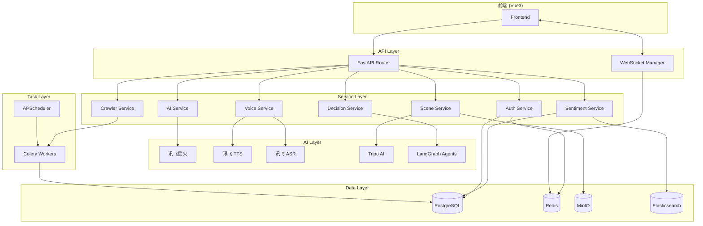

# Design Document - Backend API

## Overview

本文档描述 **智舆** 后端 API 服务的技术设计。后端采用 FastAPI + Python 构建，遵循分层架构模式，集成讯飞 AI 服务、LangGraph 多 Agent 决策、Celery 异步任务等核心能力。

## Steering Document Alignment

### Technical Standards (tech.md)

- **框架**: FastAPI 0.109+ (异步支持、自动文档)
- **ORM**: SQLAlchemy 2.0 (异步)
- **验证**: Pydantic 2.6
- **任务队列**: Celery 5.3 + Redis
- **WebSocket**: python-socketio 5.11
- **AI 集成**: 讯飞星火 4.0、LangGraph、讯飞 TTS/ASR

### Project Structure (structure.md)

遵循 `AICityBack/` 目录结构：
- `app/api/v1/` - API 路由
- `app/services/` - 业务服务
- `app/models/` - 数据模型
- `app/schemas/` - Pydantic 模式
- `agents/` - LangGraph Agent
- `ai/` - AI 能力封装

## Code Reuse Analysis

### Existing Components to Leverage

- **前端 WebSocket 服务**: `AICityFornt/src/services/websocket.js` 已实现 Socket.io 客户端，后端需兼容
- **前端 API 模式**: 参考 `AICityFornt/src/api/` 的接口设计保持一致性
- **模拟数据结构**: 参考前端 mock 数据的字段定义

### Integration Points

- **高德地图**: 坐标数据格式 `[lng, lat]`
- **前端状态管理**: Pinia store 结构对应 API 响应格式
- **ECharts**: 图表数据格式需与前端兼容

### Vector Database (RAG)

- **Chroma/Qdrant**: 舆情向量检索，支持语义搜索
- **用途**: RAG 增强、相似舆情检索、知识库问答
- **集成**: `ai/rag/vector_store.py` 封装向量操作

## Architecture



### Modular Design Principles

- **Single File Responsibility**: 每个 API 路由文件对应一个业务域
- **Component Isolation**: 服务层独立，可单独测试和替换
- **Service Layer Separation**: API -> Service -> Repository 三层分离
- **Utility Modularity**: AI 客户端、工具函数独立封装

## Components and Interfaces

### Component 1: FastAPI Application Core

- **Purpose:** 应用入口，路由注册，中间件配置
- **File:** `app/main.py`
- **Interfaces:**
  ```python
  app = FastAPI(title="智舆 API", version="1.0.0")
  app.include_router(api_router, prefix="/api/v1")
  # Socket.IO 配置：path='/ws' 与前端 websocket.js 对齐
  sio = socketio.AsyncServer(async_mode='asgi', cors_allowed_origins='*')
  sio_app = socketio.ASGIApp(sio, app, socketio_path='ws')
  ```
- **Dependencies:** FastAPI, python-socketio, uvicorn

### Component 2: Authentication Service

- **Purpose:** 用户认证、JWT 管理
- **File:** `app/services/auth_service.py`
- **Interfaces:**
  ```python
  class AuthService:
      async def authenticate(username: str, password: str) -> TokenPair
      async def verify_token(token: str) -> User
      async def refresh_token(refresh_token: str) -> TokenPair
      async def get_current_user(token: str) -> User
  ```
- **Dependencies:** `app/core/security.py`, `app/models/user.py`

### Component 3: Sentiment Service

- **Purpose:** 舆情数据 CRUD、统计分析
- **File:** `app/services/sentiment_service.py`
- **Interfaces:**
  ```python
  class SentimentService:
      async def get_hotspots(filters: HotspotFilter, pagination: Pagination) -> List[Hotspot]
      async def get_hotspot(id: int) -> Hotspot
      async def create_hotspot(data: HotspotCreate) -> Hotspot
      async def update_hotspot(id: int, data: HotspotUpdate) -> Hotspot
      async def delete_hotspot(id: int) -> bool
      async def get_statistics(city: str, time_range: TimeRange) -> Statistics
  ```
- **Dependencies:** `app/models/sentiment.py`, `app/db/session.py`

### Component 4: AI Analysis Service

- **Purpose:** 封装讯飞星火 API 调用
- **File:** `app/services/ai_service.py`, `ai/spark/client.py`
- **Interfaces:**
  ```python
  class AIService:
      async def analyze_sentiment(content: str) -> AnalysisResult
      async def extract_keywords(content: str) -> List[str]
      async def generate_summary(content: str) -> str
      async def batch_analyze(contents: List[str]) -> List[AnalysisResult]
  
  class SparkClient:
      async def chat(messages: List[Message]) -> str
      async def chat_stream(messages: List[Message]) -> AsyncGenerator[str]
  ```
- **Dependencies:** `ai/spark/config.py`, httpx/websockets

### Component 4.5: RAG Service

- **Purpose:** 检索增强生成，提供上下文感知的 AI 分析能力
- **File:** `ai/rag/vector_store.py`, `ai/rag/embeddings.py`, `ai/rag/retriever.py`
- **Interfaces:**
  ```python
  # 向量库抽象层
  class VectorStore(ABC):
      async def index(documents: List[Document], collection: str) -> int
      async def search(query_vector: List[float], collection: str, top_k: int) -> List[SearchResult]
      async def delete(doc_ids: List[str], collection: str) -> int
      async def get_collection_stats(collection: str) -> CollectionStats
  
  class ChromaVectorStore(VectorStore):
      # Chroma 实现
      pass
  
  class QdrantVectorStore(VectorStore):
      # Qdrant 实现 (可选)
      pass
  
  # 嵌入模型
  class EmbeddingModel:
      async def embed(text: str) -> List[float]
      async def embed_batch(texts: List[str]) -> List[List[float]]
      def get_dimension() -> int
  
  # RAG 检索器
  class RAGRetriever:
      async def retrieve(query: str, collection: str, top_k: int = 5, 
                        filters: Optional[dict] = None) -> List[RetrievalResult]
      async def index_hotspot(hotspot: Hotspot) -> bool
      async def rerank(query: str, results: List[RetrievalResult]) -> List[RetrievalResult]
  
  # 数据结构
  class Document(BaseModel):
      id: str
      content: str
      metadata: dict  # city, category, sentiment, timestamp 等
  
  class SearchResult(BaseModel):
      doc_id: str
      score: float
      content: str
      metadata: dict
  
  class RetrievalResult(BaseModel):
      hotspot_id: int
      relevance_score: float
      content: str
      summary: str
  ```
- **Dependencies:** chromadb, qdrant-client, sentence-transformers (或讯飞 Embedding API)
- **Collections:**
  - `hotspots` - 舆情内容向量索引
  - `analyses` - 分析结果向量索引
  - `decisions` - 决策案例向量索引

### Component 5: Decision Service

- **Purpose:** LangGraph 多 Agent 决策模拟
- **File:** `app/services/decision_service.py`, `agents/graph.py`
- **Interfaces:**
  ```python
  class DecisionService:
      async def predict_trend(hotspot_id: int, hours: int) -> TrendPrediction
      async def simulate_decision(scenario: Scenario) -> SimulationResult
      async def custom_simulate(params: CustomParams) -> SimulationResult
  
  # LangGraph State
  class SentimentState(TypedDict):
      input: str
      analysis: dict
      predictions: list
      decisions: list
      simulation: dict
  ```
- **Dependencies:** `agents/nodes/`, langgraph, `ai/spark/client.py`

### Component 6: Scene Service

- **Purpose:** 3D 场景生成管理
- **File:** `app/services/scene_service.py`, `ai/scene3d/tripo.py`
- **Interfaces:**
  ```python
  class SceneService:
      async def generate_from_text(description: str) -> GenerationTask
      async def generate_from_image(image_url: str) -> GenerationTask
      async def get_task_status(task_id: str) -> TaskStatus
      async def get_model_url(task_id: str) -> str
  
  class TripoClient:
      async def create_task(prompt: str, image: Optional[bytes]) -> str
      async def poll_status(task_id: str) -> TaskStatus
      async def download_model(task_id: str) -> bytes
  ```
- **Dependencies:** `ai/scene3d/tripo.py`, MinIO client

### Component 7: Voice Service

- **Purpose:** 语音合成与识别
- **File:** `app/services/voice_service.py`, `ai/voice/`
- **Interfaces:**
  ```python
  class VoiceService:
      async def text_to_speech(text: str, voice_id: str) -> AsyncGenerator[bytes]
      async def speech_to_text(audio_stream: AsyncGenerator[bytes]) -> str
      async def transcribe_long_audio(audio_url: str) -> str
  ```
- **Dependencies:** `ai/voice/tts.py`, `ai/voice/asr.py`, websockets

### Component 8: WebSocket Manager

- **Purpose:** 实时通信连接管理
- **File:** `app/websocket/manager.py`, `app/websocket/events.py`
- **连接规范:**
  - **路径**: `/ws`（与前端 `websocket.js` 的 `path: '/ws'` 对齐）
  - **协议**: Socket.IO（兼容前端 `socket.io-client`）
  - **事件命名**: `snake_case`
  - **心跳间隔**: 25 秒
- **Interfaces:**
  ```python
  class WebSocketManager:
      async def connect(sid: str, user_id: int)
      async def disconnect(sid: str)
      async def join_room(sid: str, room: str)
      async def leave_room(sid: str, room: str)
      async def emit(event: str, data: dict, room: Optional[str])
      async def broadcast(event: str, data: dict)
  ```
- **Dependencies:** python-socketio, Redis (pub/sub)
- **WebSocket Events (snake_case):**

  | 事件名 | 方向 | 触发时机 | Payload |
  |--------|------|----------|---------|
  | `new_sentiment` | Server->Client | 新舆情入库 | `{hotspot: Hotspot}` |
  | `hotspot_update` | Server->Client | 舆情数据更新 | `{hotspot: Hotspot}` |
  | `heat_change` | Server->Client | 热度变化超阈值 | `{hotspot_id: int, old_heat: int, new_heat: int, change: int}` |
  | `alert` | Server->Client | 预警触发 | `{alert: Alert, hotspot: Hotspot}` |
  | `analysis_complete` | Server->Client | AI分析完成 | `{hotspot_id: int, result: AnalysisResult}` |
  | `task_progress` | Server->Client | 异步任务进度 | `{task_id: str, task_type: str, progress: int, status: str}` |
  | `scene_complete` | Server->Client | 3D场景生成完成 | `{task_id: str, model_url: str}` |
  | `join_room` | Client->Server | 订阅房间 | `{room: str}` |
  | `leave_room` | Client->Server | 取消订阅 | `{room: str}` |

### Component 9: Crawler Service

- **Purpose:** 数据采集任务管理
- **File:** `app/services/crawler_service.py`, `tasks/crawler_tasks.py`
- **Interfaces:**
  ```python
  class CrawlerService:
      async def create_task(config: CrawlerConfig) -> CrawlerTask
      async def get_task_status(task_id: str) -> TaskStatus
      async def pause_task(task_id: str) -> bool
      async def resume_task(task_id: str) -> bool
      async def delete_task(task_id: str) -> bool
  ```
- **Dependencies:** Celery, `crawler/spiders/`

### Component 10: Notification Service

- **Purpose:** 实时通知推送，业务事件驱动
- **File:** `app/services/notification_service.py`
- **Interfaces:**
  ```python
  class NotificationService:
      async def notify_new_sentiment(hotspot: Hotspot)
      async def notify_heat_change(hotspot_id: int, old_heat: int, new_heat: int)
      async def notify_alert(alert: Alert)
      async def notify_analysis_complete(result: AnalysisResult)
      async def notify_task_progress(task_id: str, progress: int)
  ```
- **Dependencies:** `app/websocket/manager.py`, Redis (pub/sub)

### Component 11: Admin Service

- **Purpose:** 后台管理功能
- **File:** `app/services/admin_service.py`
- **Interfaces:**
  ```python
  class AdminService:
      async def get_users(pagination: Pagination) -> List[User]
      async def create_user(data: UserCreate) -> User
      async def update_user(user_id: int, data: UserUpdate) -> User
      async def disable_user(user_id: int) -> bool
      async def get_system_logs(filters: LogFilter) -> List[SystemLog]
      async def get_statistics() -> SystemStats
  ```
- **Dependencies:** `app/models/user.py`, `app/db/session.py`

### Component 12: Model Matrix Service

- **Purpose:** 城市模型矩阵管理 (LoRA 适配器)
- **File:** `app/services/model_service.py`, `ai/models/adapter_manager.py`
- **Interfaces:**
  ```python
  class ModelMatrixService:
      async def get_available_adapters() -> List[AdapterInfo]
      async def load_adapter(city: str) -> bool
      async def get_current_adapter() -> Optional[AdapterInfo]
      async def register_adapter(adapter: AdapterUpload) -> AdapterInfo
      async def get_fallback_adapter(city: str) -> str
  
  class AdapterManager:
      def load_lora_adapter(adapter_path: str) -> PeftModel
      def switch_adapter(target_city: str) -> bool
      def get_adapter_for_city(city: str) -> Optional[str]
  ```
- **Dependencies:** PEFT, LoRA, `ai/spark/client.py`

### Component 13: Search Service

- **Purpose:** Elasticsearch 全文检索服务封装
- **File:** `app/services/search_service.py`, `app/db/elasticsearch.py`
- **Interfaces:**
  ```python
  class SearchService:
      async def search_hotspots(query: str, filters: dict, page: int, size: int) -> SearchResult
      async def index_hotspot(hotspot: Hotspot) -> bool
      async def delete_hotspot_index(hotspot_id: int) -> bool
      async def bulk_index(hotspots: List[Hotspot]) -> int
      async def get_suggestions(prefix: str, field: str) -> List[str]
  
  class ElasticsearchClient:
      async def connect() -> None
      async def health_check() -> bool
      async def create_index(index_name: str, mapping: dict) -> bool
      async def close() -> None
  ```
- **Dependencies:** `elasticsearch[async]`, `app/models/hotspot.py`

### Component 14: Scheduler Service

- **Purpose:** APScheduler 定时调度管理
- **File:** `scheduler/config.py`, `scheduler/crawler_jobs.py`, `scheduler/handlers.py`
- **Interfaces:**
  ```python
  class SchedulerService:
      def start() -> None
      def shutdown() -> None
      def add_crawler_job(task: CrawlerTask) -> str
      def remove_job(job_id: str) -> bool
      def update_job(task: CrawlerTask) -> bool
      def get_job_status(job_id: str) -> Optional[dict]
      def list_jobs() -> List[dict]
  
  # FastAPI Lifespan Integration
  @asynccontextmanager
  async def lifespan(app: FastAPI):
      scheduler.start()
      yield
      scheduler.shutdown()
  ```
- **Dependencies:** APScheduler 3.10+, SQLAlchemy JobStore, `tasks/celery_app.py`

### Component 15: Storage Service

- **Purpose:** MinIO 对象存储服务封装
- **File:** `storage/minio_client.py`, `storage/scene_storage.py`, `storage/adapter_storage.py`
- **Interfaces:**
  ```python
  class MinIOClient:
      async def connect() -> None
      async def health_check() -> bool
      async def ensure_bucket(bucket_name: str) -> bool
      async def close() -> None
  
  class SceneStorage:
      async def upload_model(task_id: int, file_data: bytes, format: str) -> str
      async def download_model(task_id: int) -> bytes
      async def get_presigned_url(task_id: int, expires: int = 3600) -> str
      async def delete_model(task_id: int) -> bool
  
  class AdapterStorage:
      async def upload_adapter(city_code: str, version: str, file_data: bytes) -> str
      async def download_adapter(adapter_path: str) -> bytes
      async def list_adapters(city_code: str) -> List[str]
      async def delete_adapter(adapter_path: str) -> bool
  ```
- **Dependencies:** minio-py SDK, `app/core/config.py`

## Data Models

### User Model
```python
class User(Base):
    __tablename__ = "users"
    
    id: int                      # Primary Key
    username: str                # Unique, indexed
    email: str                   # Unique
    hashed_password: str
    role: str                    # admin, analyst, viewer
    is_active: bool              # Default True
    created_at: datetime
    updated_at: datetime
```

### Sentiment/Hotspot Model
```python
class Hotspot(Base):
    __tablename__ = "hotspots"
    
    id: int                      # Primary Key
    title: str                   # 标题
    content: str                 # 内容
    source: str                  # 来源平台
    source_url: str              # 原始链接
    media_type: str              # text, image, video
    media_urls: List[str]        # JSON Array
    city: str                    # 城市
    district: str                # 区县
    location: dict               # {lng, lat}
    heat: int                    # 热度值
    sentiment: str               # positive, neutral, negative
    sentiment_score: float       # -1.0 ~ 1.0
    keywords: List[str]          # JSON Array
    summary: str                 # AI 摘要
    status: str                  # active, archived, deleted
    published_at: datetime       # 发布时间
    created_at: datetime
    updated_at: datetime
```

### Analysis Result Model
```python
class AnalysisResult(Base):
    __tablename__ = "analysis_results"
    
    id: int
    hotspot_id: int              # Foreign Key
    analysis_type: str           # sentiment, prediction, decision
    result: dict                 # JSON - 分析结果
    model_version: str           # AI 模型版本
    processing_time: float       # 处理耗时 (ms)
    created_at: datetime
```

### Scene Generation Task Model
```python
class SceneTask(Base):
    __tablename__ = "scene_tasks"
    
    id: int
    hotspot_id: int              # Foreign Key (optional)
    input_type: str              # text, image
    input_content: str           # 输入内容/URL
    status: str                  # pending, processing, completed, failed
    progress: int                # 0-100
    model_url: str               # MinIO 存储路径
    error_message: str           # 错误信息
    created_at: datetime
    completed_at: datetime
```

### Crawler Task Model
```python
class CrawlerTask(Base):
    __tablename__ = "crawler_tasks"
    
    id: int
    name: str                    # 任务名称
    source: str                  # weibo, xiaohongshu, douyin...
    keywords: List[str]          # 监控关键词
    schedule: str                # cron 表达式
    is_active: bool
    last_run_at: datetime
    next_run_at: datetime
    total_collected: int         # 累计采集数
    created_at: datetime
```

### System Log Model
```python
class SystemLog(Base):
    __tablename__ = "system_logs"
    
    id: int
    user_id: int                 # Foreign Key (nullable)
    action: str                  # login, create, update, delete, analyze...
    resource_type: str           # user, hotspot, task, adapter...
    resource_id: int             # 操作资源 ID
    details: dict                # JSON - 操作详情
    ip_address: str
    user_agent: str
    created_at: datetime
```

### Model Adapter Info
```python
class AdapterInfo(Base):
    __tablename__ = "model_adapters"
    
    id: int
    name: str                    # 适配器名称
    city: str                    # 城市名
    province: str                # 省份名
    level: str                   # city, province, national
    adapter_path: str            # MinIO 存储路径
    base_model: str              # 基座模型版本
    version: str                 # 适配器版本
    metrics: dict                # JSON - 训练指标
    is_active: bool
    created_at: datetime
```

## Error Handling

### Error Scenarios

1. **认证失败 (401)**
   - **Handling:** 返回 `{"detail": "Invalid credentials", "code": "AUTH_FAILED"}`
   - **User Impact:** 前端跳转登录页

2. **权限不足 (403)**
   - **Handling:** 返回 `{"detail": "Permission denied", "code": "FORBIDDEN"}`
   - **User Impact:** 提示无权限操作

3. **资源不存在 (404)**
   - **Handling:** 返回 `{"detail": "Hotspot not found", "code": "NOT_FOUND"}`
   - **User Impact:** 显示资源不存在提示

4. **验证失败 (422)**
   - **Handling:** 返回 Pydantic 验证错误详情
   - **User Impact:** 显示具体字段错误

5. **AI 服务不可用 (503)**
   - **Handling:** 返回 `{"detail": "AI service unavailable", "code": "SERVICE_UNAVAILABLE"}`，记录日志，触发告警
   - **User Impact:** 显示降级提示，使用缓存数据

6. **速率限制 (429)**
   - **Handling:** 返回 `{"detail": "Too many requests", "retry_after": 60}`
   - **User Impact:** 显示稍后重试提示

### 统一错误响应格式

```python
class ErrorResponse(BaseModel):
    detail: str                  # 错误描述
    code: str                    # 错误代码
    timestamp: datetime          # 时间戳
    path: str                    # 请求路径
    request_id: str              # 请求追踪 ID
```

## Testing Strategy

### Unit Testing

- **框架**: pytest + pytest-asyncio
- **覆盖目标**: 
  - Services: 90%+
  - Models: 85%+
  - Utils: 95%+
- **Mock**: 使用 `unittest.mock` 模拟外部服务

### Integration Testing

- **数据库**: 使用 SQLite 内存数据库或 TestContainers
- **Redis**: 使用 fakeredis
- **关键流程**:
  - 认证流程完整测试
  - 舆情 CRUD 完整测试
  - WebSocket 连接测试

### End-to-End Testing

- **工具**: pytest + httpx AsyncClient
- **场景**:
  - 用户登录 -> 获取舆情 -> AI 分析 -> 决策模拟
  - WebSocket 连接 -> 接收实时推送
  - 采集任务创建 -> 数据入库 -> 触发分析
